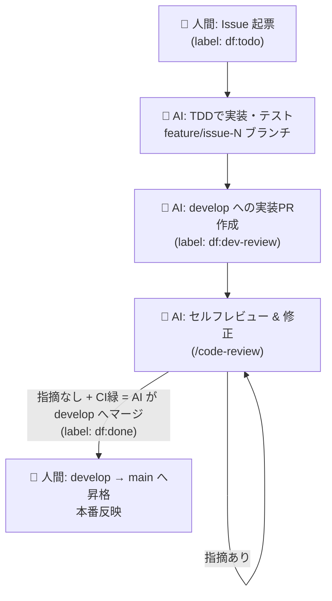

# Dark Factory 開発ワークフロー設計

> 「Dark Factory（消灯工場）」= 人間は **意思決定と承認** だけを行い、実装作業の大半を AI が自動で回す開発体制。
> 本ドキュメントは ai-workspace リポジトリにおける Issue → 実装 → レビュー → リリースのワークフローを定義する。
> **人間が触るのは「Issue 起票」と「main 昇格」の 2 点だけ。** 独立した設計 PR とその人間承認は廃止し、AI が 1 回の `/df` 実行で 実装 → 実装 PR → セルフレビュー → develop マージまで自走する（人間確認の最小化）。設計書は廃止せず実装 PR に同梱する。AI は専用 worktree を使わず feature ブランチで直接作業する。

## 1. 全体像



**役割分担の原則**

| 担当 | やること |
|------|----------|
| 👤 人間 | Issue 起票、本番リリース判断（main 昇格） |
| 🤖 AI | 設計判断、TDD実装、テスト、PR作成、セルフレビュー・修正、develop へのマージ |

人間は「ゲート（承認の門）」にだけ立つ。門と門のあいだは AI が走る。門は **入口（Issue 起票）** と **出口（本番昇格）** の 2 つだけ。

## 2. ブランチ戦略

| ブランチ | 役割 | 保護 | 反映先 |
|----------|------|------|--------|
| `main` | 本番（production） | ✅ 保護・人間のみマージ可 | 本番環境 |
| `develop` | 統合（integration） | ✅ PR必須・CI緑必須（実装PRは AI がレビュー・マージ） | ステージング |
| `feature/issue-<N>` | 実装 | - | → `develop`（実装PR） |

- AI が作る PR は **実装 PR の 1 種類だけ**（設計 PR は廃止）。1 Issue = 1 実装ブランチ = 1 実装 PR。
- `develop` への実装PR は **AI 自身がレビュー → 修正 → マージ** する（人間の承認は不要）。CI 緑を必須にして暴走を防ぐ。
- `main` への直接 push は禁止。`develop → main` の昇格 PR は **人間だけ** がマージする（＝本番反映は人間）。

## 3. ラベルによる状態機械

Issue の状態をラベルで表現し、各フェーズの起点トリガーにする。

| ラベル | 意味 | 次に動くのは |
|--------|------|--------------|
| `df:todo` | 人間が Issue を起票済み。AI 着手待ち | 🤖 AI（実装） |
| `df:dev-review` | 実装PR 作成済み。AI がレビュー → 修正 → develop へマージ | 🤖 AI |
| `df:done` | develop マージ済み。本番昇格待ち | 👤 人間 |
| `df:blocked` | AI が判断不能・要人間介入 | 👤 人間 |

ラベル遷移は「誰の番か」を一目で示すダッシュボードになる。AI 実行可能なのは `df:todo` / `df:dev-review`、人間の番は `df:done` / `df:blocked`。

### 優先度ラベル（`priority/*`）

`df:*`（誰の番か）とは**直交する軸**で、AI 実行可能 Issue が複数あるときに **AI がどれを先に着手するか**（`/df` の自動選択）を決める。人間が起票時に任意で 1 つ付ける。

| ラベル | 意味 | 重み |
|--------|------|:----:|
| `priority/critical` | 緊急・最優先 | 4 |
| `priority/high` | 高 | 3 |
| `priority/medium` | 中（**ラベル無しと同等のデフォルト**） | 2 |
| `priority/low` | 低 | 1 |

- `priority/*` を**付けない Issue は `medium`（重み 2）扱い**＝未設定でも `low` に埋もれない。
- `/df`（引数なし）の着手順は **優先度の重み降順 → フェーズ進捗（`df:dev-review` ＞ `df:todo`）→ `createdAt` 古い順（FIFO）** の順に評価する（`.claude/commands/df.md` STEP 1-B が正本）。
- 優先度は着手順を決めるだけで、`df:done` / `df:blocked`（人間の番）の判定は上書きしない。

## 4. フェーズ詳細

### フェーズ 1 — 👤 人間: Issue 起票

- Issue テンプレート（`.github/ISSUE_TEMPLATE/feature.yml`）に沿って **目的・背景・受け入れ条件** を記述。
- 作成時にラベル `df:todo` を付与（テンプレートで自動付与）。
- 任意で **優先度ラベル `priority/*` を 1 つ**付ける（緊急なら `priority/critical`/`high`）。付けなければ `medium` 相当。複数の AI 実行可能 Issue があるとき `/df` がこれを見て着手順を決める。
- **受け入れ条件をテストに落とせる粒度で書くのがコツ**（設計レビューが無くなった分、Issue 本文が実装の正本になる）。曖昧で AI が実装方針を確定できない場合、AI はフェーズ 2 で質問をコメントし `df:blocked` にする。

### フェーズ 2 — 🤖 AI: 設計書 + TDD 実装 → 実装PR作成

**トリガー**: Issue に `df:todo` が付く

1. Issue 本文・受け入れ条件・関連 ADR（`docs/adr/*.md`）・`concept.md`・既存コードを読み込む。**ADR の決定が正本**。情報が決定的に不足し受け入れ条件をテストに落とせないなら、設計を捏造せず `df:blocked`（フェーズ 4）。
2. `feature/issue-<N>` ブランチを `develop` から作成（**専用 worktree は使わず直接 checkout する**）。
3. 設計書 `docs/design/issue-<N>.md`（テンプレートは §6）を書いてコミットする。**独立した設計 PR は作らず、この実装ブランチに同梱する**（人間承認は挟まない）。
4. `CLAUDE.md` の方針に従い **テスト駆動開発（TDD）** で進める:
   - 受け入れ条件を入出力に落とし、**まずテストを書く**（実装は書かない）→ テスト実行して失敗を確認 → コミット。
   - テストを通す最小実装 → 緑にする。実装中はテストを変更しない。
   - 全テスト緑 + lint 通過まで反復。機能単位で細かくコミット（規約は §7）。
5. `feature/issue-<N>` を push し、`develop` 向けに **実装PR** を作成（設計書を含む。本文に `Closes #N`、設計判断の要点、テスト結果サマリを記載）。
6. Issue を `df:dev-review` に更新し、**そのまま続けてフェーズ 3（セルフレビュー → マージ）へ進む**。

> `/df` は 1 回の実行でフェーズ 2 → 3 を続けて完走する（実装 → 実装 PR → セルフレビュー → develop マージ）。フェーズ 2・3 の間に人間の確認は入らない。

### フェーズ 3 — 🤖 AI: セルフレビュー → 修正 → develop マージ

**トリガー**: Issue に `df:dev-review` が付く

1. `/code-review`（または `code-review` スキル）で実装PR をレビューする。
2. 指摘（バグ・簡素化・効率）を自分で修正してコミット。
3. 指摘がなくなる（収束する）まで 1〜2 を反復する。
4. CI（test + lint）が緑かつレビュー指摘ゼロになったら、**AI が `develop` へマージ**する。
5. Issue に `df:done` を付与。
   - 自力で解消できない指摘がある・実装方針に確信が持てない場合は `df:blocked` を付け、人間に委ねる。

### フェーズ 4 — 👤 人間: 本番反映

- 任意のタイミングで `develop → main` の昇格 PR を作成しマージ（**人間のみ**）。
- main マージ＝本番デプロイ（デプロイ手段は別途）。Issue をクローズ。

## 5. 自動化の実装方式

トリガー（ラベル付与・PRコメント）から AI を起動する方法は 2 通り。**まずは方式 B（ローカル/手動）で運用を固め、安定したら方式 A へ移行**するのを推奨。

### 方式 A: GitHub Actions + Claude Code Action（フル自動 / 消灯運転）

- `.github/workflows/df-implement.yml`: `issues` の `labeled`（`df:todo`）で起動 → TDD実装 → 実装PR → `df:dev-review`。
- `.github/workflows/df-review-merge.yml`: `df:dev-review` で起動 → セルフレビュー → 修正 → 収束 + CI緑後に develop へマージ → `df:done`。
- 必要なもの:
  - リポジトリ Secret `ANTHROPIC_API_KEY`
  - `anthropics/claude-code-action`（`@claude` メンション/イベント駆動）
  - Actions の権限（`contents: write`, `pull-requests: write`, `issues: write`）
- メリット: 人間が `df:todo` を付けるだけで PR がマージまで進む。デメリット: コスト・暴走防止のガード設計が必要。

### 方式 B: ローカル Claude Code（手動 / 半自動）

- `/df` コマンド（`.claude/commands/df.md`）が Open Issue の `df:*` ラベルを見て「今 AI がやるべき 1 件」を自動選択し、**1 回の実行で `df:todo` → `df:done` まで完走**する（実装 → 実装 PR → セルフレビュー → develop マージ）。
  - `df:todo` の Issue: 設計書 + TDD 実装 → 実装 PR → そのままセルフレビュー → CI緑 + 指摘ゼロで develop マージ → `df:done`。
  - `df:dev-review` の Issue（前回が途中で止まった等の再開）: レビュー → 修正 → develop マージ → `df:done`。
- `/loop /df` や `/schedule` でラベル監視を定期実行すれば半自動運転になる。
- メリット: すぐ始められる・挙動を見ながら調整できる。デメリット: 起動は人間がやる。

## 6. ディレクトリ構成（追加分）

```
.
├── concept.md
├── CLAUDE.md                      # 開発方針（TDD等）。後述の運用ルールを追記
├── docs/
│   ├── dark-factory-workflow.md   # 本ドキュメント
│   └── design/
│       └── issue-<N>.md           # Issueごとの設計書（AI生成・実装PRに同梱・人間承認なし）
└── .github/
    ├── ISSUE_TEMPLATE/
    │   └── feature.yml            # df:todo を自動付与
    ├── pull_request_template.md
    └── workflows/                 # 方式A採用時のみ
        ├── df-implement.yml
        └── df-review-merge.yml
```

### 設計書テンプレート（`docs/design/issue-<N>.md`）

設計書は **feature ブランチで実装と一緒に書き、実装 PR に同梱する**（独立した設計 PR・人間承認は無い）。設計の正本は Issue 本文の受け入れ条件 + ADR、設計判断の記録はこの設計書 + 実装 PR 本文。

```markdown
# 設計書: <Issue題名> (#N)

## 1. 目的 / 背景
## 2. スコープ（やること / やらないこと）
## 3. 受け入れ条件（テストに落とせる粒度で箇条書き）
## 4. 設計方針（アーキ・データ構造・主要モジュール）
## 5. 影響範囲 / 既存への変更（対象ワークスペース: client / server / common / docs）
## 6. テスト計画（TDDで書くテスト一覧）
## 7. リスク・未決事項
```

## 7. 品質ゲート

| ゲート | 内容 | 強制方法 |
|--------|------|----------|
| Issue 粒度 | 受け入れ条件がテストに落とせる粒度。不足なら AI は `df:blocked` | AI 実行 + Issue テンプレート |
| TDD | テスト先行・実装中はテスト不変 | CLAUDE.md + レビュー |
| CI | `test` と `lint` が緑 | branch protection の required check |
| レビュー | `/code-review` 指摘を収束まで解消 | AI 実行 |
| 実装マージ | CI 緑 + 指摘ゼロで AI が `develop` へマージ | AI 実行（CI を required check に） |
| 本番昇格 | `develop → main` を人間がマージ | main 保護・push禁止 |

**コミットメッセージ規約**（Conventional Commits 準拠）:
`feat:` / `fix:` / `refactor:` / `docs:` / `config:` / `test:` / `style:`

## 8. セットアップ手順

このリポジトリはまだコミット・ブランチが無いため、以下を初期化する。

1. **初期コミット & ブランチ作成**
   - `main` に初期コミット → `develop` を作成。
2. **ラベル作成**（`gh label create df:todo` など §3 の4種: `df:todo` / `df:dev-review` / `df:done` / `df:blocked`）。
3. **ブランチ保護**（`main`・`develop`）: PR必須・直接push禁止。`develop` は CI（test/lint）を required check に。
4. **Issue テンプレート / PR テンプレート** を `.github/` に配置（テンプレートは `df:todo` を自動付与）。
5. （方式A採用時）Secret `ANTHROPIC_API_KEY` 登録 + ワークフロー2本を追加。
6. **CLAUDE.md に運用ルールを追記**（本ワークフローへの参照、ラベル遷移の規約）。

## 9. このリポジトリでの実現可否

**実現可能。** 根拠と前提:

- ✅ GitHub Issues 有効・Public リポジトリ。
- ✅ `gh` 認証済み、トークンに `repo` / `workflow` / `project` スコープあり → Actions 追加・ラベル/PR 操作が可能。
- ✅ TDD 方針（`CLAUDE.md`）と `/df` コマンド（`.claude/commands/df.md`）が既にあり、実装〜マージフェーズの土台が揃っている。
- ⚠️ 現状コミット/ブランチが無いため、§8 の初期化が前提。
- ⚠️ フル自動（方式A）は `ANTHROPIC_API_KEY` の Secret 登録とコストガードが必要。

## 10. 段階的導入ロードマップ

1. **Step 0**: 初期化（main/develop・ラベル・テンプレート・ブランチ保護）。
2. **Step 1**: 方式B（`/df`）で 1 Issue を手動で一周（起票→実装→レビュー→develop マージ→人間が昇格）。フローを検証。
3. **Step 2**: `/loop /df` でラベル監視を半自動化。Issue 受け入れ条件の粒度を調整。
4. **Step 3**: 方式A（Actions）導入。`df:todo` 付与だけで実装 PR が出る状態に。
5. **Step 4**: レビュー・develop マージも Actions 化。人間はゲート（Issue 起票 + 本番昇格）のみに。
