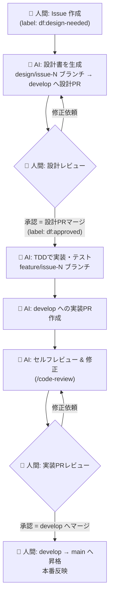

# Dark Factory 開発ワークフロー設計

> 「Dark Factory（消灯工場）」= 人間は **意思決定と承認** だけを行い、実装作業の大半を AI が自動で回す開発体制。
> 本ドキュメントは ai-workspace リポジトリにおける Issue → 設計 → 実装 → レビュー → リリースのワークフローを定義する。

## 1. 全体像



**役割分担の原則**

| 担当 | やること |
|------|----------|
| 👤 人間 | Issue 作成、設計レビュー/承認、実装PRレビュー/承認、本番リリース判断 |
| 🤖 AI | 設計書作成、TDD実装、テスト、PR作成、セルフレビュー・修正 |

人間は「ゲート（承認の門）」にだけ立つ。門と門のあいだは AI が走る。

## 2. ブランチ戦略

| ブランチ | 役割 | 保護 | 反映先 |
|----------|------|------|--------|
| `main` | 本番（production） | ✅ 保護・人間のみマージ可 | 本番環境 |
| `develop` | 統合（integration） | ✅ PR必須・1レビュー承認必須 | ステージング |
| `design/issue-<N>` | 設計書専用 | - | → `develop`（設計PR） |
| `feature/issue-<N>` | 実装 | - | → `develop`（実装PR） |

- 設計書と実装で **ブランチ・PR を分ける**。これにより「設計の承認」と「実装の承認」が独立した2つのゲートになる。
- `main` への直接 push は禁止。`develop → main` の昇格 PR は **人間だけ** がマージする（＝本番反映は人間）。

## 3. ラベルによる状態機械

Issue の状態をラベルで表現し、各フェーズの起点トリガーにする。

| ラベル | 意味 | 次に動くのは |
|--------|------|--------------|
| `df:design-needed` | 人間が Issue を作成済み。設計待ち | 🤖 AI（設計） |
| `df:design-review` | 設計PR 作成済み。レビュー待ち | 👤 人間 |
| `df:approved` | 設計承認済み。実装開始可 | 🤖 AI（実装） |
| `df:dev-review` | 実装PR 作成済み。セルフレビュー後、人間レビュー待ち | 👤 人間 |
| `df:done` | develop マージ済み。本番昇格待ち | 👤 人間 |
| `df:blocked` | AI が判断不能・要人間介入 | 👤 人間 |

ラベル遷移は「誰の番か」を一目で示すダッシュボードになる。

## 4. フェーズ詳細

### フェーズ 1 — 人間: Issue 作成

- Issue テンプレート（`.github/ISSUE_TEMPLATE/feature.yml`）に沿って **目的・背景・受け入れ条件** を記述。
- 作成時にラベル `df:design-needed` を付与（テンプレートで自動付与）。
- AI が設計できる粒度で書くのがコツ。曖昧な場合 AI は フェーズ2 で質問をコメントし `df:blocked` に。

### フェーズ 2 — 🤖 AI: 設計書作成

**トリガー**: Issue に `df:design-needed` が付く

1. Issue 本文・関連コード・`concept.md` を読み込む。
2. `design/issue-<N>` ブランチを作成。
3. `docs/design/issue-<N>.md` に設計書を生成（テンプレートは §6）。
4. `develop` 向けに **設計PR** を作成（タイトル `Design: <Issue題名> (#N)`、本文に `Refs #N`）。
5. Issue を `df:design-review` に更新。

**成果物**: 設計書 1ファイル + 設計PR。**コードは書かない**。

### フェーズ 3 — 👤 人間: 設計レビュー

- 設計PR をレビュー。方針・スコープ・受け入れ条件を確認。
- **修正依頼** → PR にコメント。AI が設計を更新（フェーズ2へ戻る）。
- **承認** → 設計PR をマージ し、Issue に `df:approved` を付与。
  - マージにより設計書が `develop` に記録され、実装フェーズの正本になる。

### フェーズ 4 — 🤖 AI: TDD 実装・テスト

**トリガー**: Issue に `df:approved` が付く

`CLAUDE.md` の方針に従い **テスト駆動開発（TDD）** で進める:

1. `feature/issue-<N>` ブランチを `develop` から作成。
2. 設計書（`docs/design/issue-<N>.md`）の受け入れ条件を入出力に落とす。
3. **まずテストを書く**（実装は書かない）→ テスト実行して失敗を確認 → コミット。
4. テストを通す最小実装 → テストを通す。実装中はテストを変更しない。
5. 全テスト緑になるまで反復。lint も通す。
6. 機能単位で細かくコミット（規約は §7）。

### フェーズ 5 — 🤖 AI: 実装PR作成 + セルフレビュー

1. `feature/issue-<N>` を push し、`develop` 向けに **実装PR** を作成（本文に `Closes #N`、テスト結果サマリを記載）。
2. `/code-review`（または `code-review` スキル）でセルフレビューを実行。
3. 指摘（バグ・簡素化・効率）を自分で修正してコミット。
4. CI（test + lint）が緑になったら Issue を `df:dev-review` に更新。

### フェーズ 6 — 👤 人間: 実装PRレビュー

- 実装PR をレビュー。設計どおりか・テスト妥当か確認。
- **修正依頼** → コメント。AI が修正（フェーズ5へ戻る）。
- **承認** → `develop` へマージ、Issue に `df:done` を付与。

### フェーズ 7 — 👤 人間: 本番反映

- 任意のタイミングで `develop → main` の昇格 PR を作成しマージ（**人間のみ**）。
- main マージ＝本番デプロイ（デプロイ手段は別途）。Issue をクローズ。

## 5. 自動化の実装方式

トリガー（ラベル付与・PRコメント）から AI を起動する方法は 2 通り。**まずは方式 B（ローカル/手動）で運用を固め、安定したら方式 A へ移行**するのを推奨。

### 方式 A: GitHub Actions + Claude Code Action（フル自動 / 消灯運転）

- `.github/workflows/df-design.yml`: `issues` の `labeled`（`df:design-needed`）で起動 → 設計書PR。
- `.github/workflows/df-develop.yml`: `df:approved` で起動 → 実装 → 実装PR → セルフレビュー。
- `.github/workflows/df-review-fix.yml`: 実装PRへの人間コメントで起動 → 修正。
- 必要なもの:
  - リポジトリ Secret `ANTHROPIC_API_KEY`
  - `anthropics/claude-code-action`（`@claude` メンション/イベント駆動）
  - Actions の権限（`contents: write`, `pull-requests: write`, `issues: write`）
- メリット: 人間がラベルを付けるだけで完全自動。デメリット: コスト・暴走防止のガード設計が必要。

### 方式 B: ローカル Claude Code（手動 / 半自動）

- 各フェーズを人間がコマンドで起動:
  - 設計: `「Issue #N の設計書を作って設計PRを出して」`
  - 実装: 既存 `/auto-task`（自立的Issue解消）を `df:approved` の Issue に対して実行
  - レビュー修正: `/code-review --fix`
- `/loop` や `/schedule` でラベル監視を定期実行し半自動化も可能。
- メリット: すぐ始められる・挙動を見ながら調整できる。デメリット: 起動は人間がやる。

## 6. ディレクトリ構成（追加分）

```
.
├── concept.md
├── CLAUDE.md                      # 開発方針（TDD等）。後述の運用ルールを追記
├── docs/
│   ├── dark-factory-workflow.md   # 本ドキュメント
│   └── design/
│       └── issue-<N>.md           # Issueごとの設計書（AI生成・人間承認）
└── .github/
    ├── ISSUE_TEMPLATE/
    │   └── feature.yml            # df:design-needed を自動付与
    ├── pull_request_template.md
    └── workflows/                 # 方式A採用時のみ
        ├── df-design.yml
        ├── df-develop.yml
        └── df-review-fix.yml
```

### 設計書テンプレート（`docs/design/issue-<N>.md`）

```markdown
# 設計書: <Issue題名> (#N)

## 1. 目的 / 背景
## 2. スコープ（やること / やらないこと）
## 3. 受け入れ条件（テストに落とせる粒度で箇条書き）
## 4. 設計方針（アーキ・データ構造・主要モジュール）
## 5. 影響範囲 / 既存への変更
## 6. テスト計画（TDDで書くテスト一覧）
## 7. リスク・未決事項
```

## 7. 品質ゲート

| ゲート | 内容 | 強制方法 |
|--------|------|----------|
| 設計承認 | 人間が設計PRを承認・マージ | ブランチ保護 |
| TDD | テスト先行・実装中はテスト不変 | CLAUDE.md + レビュー |
| CI | `test` と `lint` が緑 | branch protection の required check |
| セルフレビュー | `/code-review` 指摘の解消 | AI 実行 |
| 実装承認 | 人間が実装PRを承認 | branch protection（1 approval 必須） |
| 本番昇格 | `develop → main` を人間がマージ | main 保護・push禁止 |

**コミットメッセージ規約**（`auto-task` 準拠）:
`feat:` / `fix:` / `refactor:` / `docs:` / `config:` / `test:` / `style:`

## 8. セットアップ手順

このリポジトリはまだコミット・ブランチが無いため、以下を初期化する。

1. **初期コミット & ブランチ作成**
   - `main` に初期コミット → `develop` を作成。
2. **ラベル作成**（`gh label create df:design-needed` など §3 の6種）。
3. **ブランチ保護**（`main`・`develop`）: PR必須・直接push禁止、`develop` は1承認必須。
4. **Issue テンプレート / PR テンプレート** を `.github/` に配置。
5. **設計書ディレクトリ** `docs/design/` を用意。
6. （方式A採用時）Secret `ANTHROPIC_API_KEY` 登録 + ワークフロー3本を追加。
7. **CLAUDE.md に運用ルールを追記**（本ワークフローへの参照、ラベル遷移の規約）。

## 9. このリポジトリでの実現可否

**実現可能。** 根拠と前提:

- ✅ GitHub Issues 有効・Public リポジトリ。
- ✅ `gh` 認証済み、トークンに `repo` / `workflow` / `project` スコープあり → Actions 追加・ラベル/PR 操作が可能。
- ✅ TDD 方針（`CLAUDE.md`）と `auto-task` コマンドが既にあり、実装フェーズの土台が揃っている。
- ⚠️ 現状コミット/ブランチが無いため、§8 の初期化が前提。
- ⚠️ フル自動（方式A）は `ANTHROPIC_API_KEY` の Secret 登録とコストガードが必要。

## 10. 段階的導入ロードマップ

1. **Step 0**: 初期化（main/develop・ラベル・テンプレート・ブランチ保護）。
2. **Step 1**: 方式B で 1 Issue を手動で一周（設計→承認→実装→レビュー→昇格）。フローを検証。
3. **Step 2**: `/loop` でラベル監視を半自動化。設計書テンプレや受け入れ条件の精度を調整。
4. **Step 3**: 方式A（Actions）導入。`df:design-needed` 付与だけで設計PRが出る状態に。
5. **Step 4**: 実装・セルフレビューも Actions 化。人間はゲート（2レビュー + 本番昇格）のみに。
